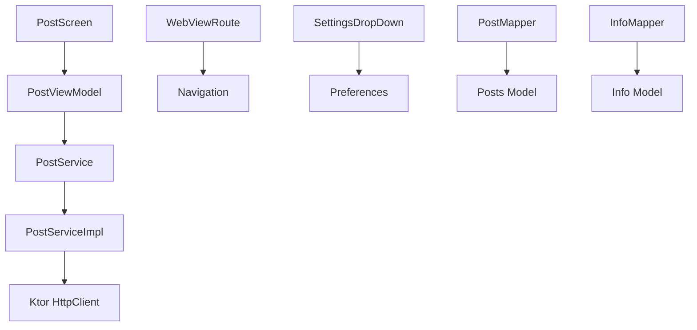

# Mapa de Migración StarGazer - Módulo Posts

**Fecha inicio:** 29 Octubre 2024  
**Estado actual:** Fase 1 - Reestructuración de Módulos  
**Versión Molecule:** 2.0.0  
**Versión Turbine:** 1.0.0  

---

## 📁 Estructura Actual del Módulo Posts

### ✅ Domain Layer (Ya organizado correctamente)
- ✅ `domain/model/Info.kt` - Modelo de dominio Info
- ✅ `domain/model/Posts.kt` - Modelo de dominio Posts
- ✅ `domain/model/PostType.kt` - Enum PostType
- ✅ `domain/InfoService.kt` - Interface de servicio Info
- ✅ `domain/PostService.kt` - Interface de servicio Posts
- 📁 `domain/repository/` - **VACÍO** (Crear interfaces aquí)
- 📁 `domain/usecase/` - **VACÍO** (Crear use cases aquí)

### ⚠️ Data Layer (Necesita organización)
- ✅ `data/model/InfoResponse.kt` - DTO Info
- ✅ `data/model/PostsResponse.kt` - DTO Posts
- ✅ `data/remote/InfoServiceImpl.kt` - Implementación API Info
- ✅ `data/remote/PostServiceImpl.kt` - Implementación API Posts
- ✅ `data/InfoMapper.kt` - Mapper Info (mover a `data/mapper/`)
- ✅ `data/PostMapper.kt` - Mapper Posts (mover a `data/mapper/`)
- 📁 `data/local/` - **VACÍO** (Cache/DB si es necesario)
- 📁 `data/repository/` - **VACÍO** (Crear implementaciones aquí)

### ⚠️ Presentation Layer (Necesita migración a Molecule)
- ❌ `ui/posts/PostViewModel.kt` → Migrar a `presentation/list/PostsListPresenter.kt`
- ❌ `ui/posts/PostScreen.kt` → Refactorizar a `presentation/list/PostsListScreen.kt`
- ❌ `ui/posts/PostRoute.kt` → Refactorizar a `presentation/list/PostsListRoute.kt`
- ❌ `ui/posts/PostContent.kt` → Mover a `presentation/list/PostsListContent.kt`
- ❌ `ui/webview/WebViewRoute.kt` → Migrar a `presentation/detail/PostDetailRoute.kt`
- ❌ `ui/webview/EmptyWebView.kt` → Mantener en `presentation/detail/`
- ❌ `ui/settings/SettingsDropDown.kt` → Mover a `presentation/settings/`
- ⚠️ `ui/ViewState.kt` - Evaluar si mantener o crear estados específicos

### ✅ Dependency Injection
- ✅ `di/KoinDI.kt` - Configuración Koin (actualizar con nuevos módulos)

---

## 🔄 Plan de Migración por Componente

### ViewModels Existentes
| Actual | Migrar a | Estado |
|--------|----------|--------|
| `ui/posts/PostViewModel.kt` | `presentation/list/PostsListPresenter.kt` | ⏳ Pendiente |
| *(WebView no tiene ViewModel)* | `presentation/detail/PostDetailPresenter.kt` | 🆕 Crear nuevo |
| *(Settings no tiene ViewModel)* | `presentation/settings/SettingsPresenter.kt` | 🆕 Crear nuevo |

### Services/Repositories
| Actual | Migrar a | Notas |
|--------|----------|-------|
| `domain/InfoService.kt` | `domain/repository/InfoRepository.kt` | Renombrar + adaptar interface |
| `domain/PostService.kt` | `domain/repository/PostRepository.kt` | Renombrar + adaptar interface |
| `data/remote/InfoServiceImpl.kt` | `data/repository/InfoRepositoryImpl.kt` | Implementación repository |
| `data/remote/PostServiceImpl.kt` | `data/repository/PostRepositoryImpl.kt` | Implementación repository |

### Screens/Composables
| Actual | Nuevo | Tipo |
|--------|-------|------|
| `ui/posts/PostScreen.kt` | `presentation/list/PostsListScreen.kt` | Refactorizar con Molecule |
| `ui/posts/PostRoute.kt` | `presentation/list/PostsListRoute.kt` | Actualizar navegación |
| `ui/posts/PostContent.kt` | `presentation/list/PostsListContent.kt` | Mover y adaptar |
| `ui/webview/WebViewRoute.kt` | `presentation/detail/PostDetailRoute.kt` | Refactorizar |
| `ui/webview/EmptyWebView.kt` | `presentation/detail/EmptyWebView.kt` | Mover |
| `ui/settings/SettingsDropDown.kt` | `presentation/settings/SettingsDropDown.kt` | Mover |

---

## 📦 Use Cases a Crear (Fase 2)

### Posts Use Cases
- [ ] `GetPostsUseCase.kt` - Obtener lista de posts filtrada
- [ ] `GetPostByIdUseCase.kt` - Obtener post específico
- [ ] `SearchPostsUseCase.kt` - Buscar posts

### Info/Settings Use Cases
- [ ] `GetInfoUseCase.kt` - Obtener información
- [ ] `GetPreferencesUseCase.kt` - Obtener preferencias
- [ ] `UpdatePreferencesUseCase.kt` - Actualizar preferencias

---

## 🔧 Tareas Pendientes Fase 1

### Reorganización de Archivos
- [ ] Mover `data/InfoMapper.kt` → `data/mapper/InfoMapper.kt`
- [ ] Mover `data/PostMapper.kt` → `data/mapper/PostMapper.kt`
- [ ] Actualizar imports después de mover mappers
- [ ] Compilar y verificar: `./gradlew :posts:build`

### Crear MIGRATION_MAP.md
- [x] Crear archivo de inventario completo
- [ ] Validar con equipo

---

## 🎯 Próximos Pasos

1. **Fase 2: Domain Layer** - Crear interfaces de repositorios y use cases
2. **Fase 3: Data Layer** - Implementar repositorios
3. **Fase 4: Presentation Layer - Posts List** - Migrar a Molecule
4. **Fase 5: Presentation Layer - Post Detail** - Crear con Molecule
5. **Fase 6: Presentation Layer - Settings** - Crear con Molecule

---

## 📊 Dependencias Identificadas

---

## ⚠️ Notas Importantes

- **No eliminar código antiguo** hasta que la nueva implementación esté funcionando
- **Mantener compilación** en cada paso
- **Tests**: Actualmente no se detectaron tests en el módulo
- **Navegación**: Usar Type-Safe Navigation con `@Serializable`
- **Estado**: Preferir `State<T>` sobre `StateFlow` en presenters

---

## 📝 Log de Cambios

| Fecha | Fase | Cambio | Commit |
|-------|------|--------|--------|
| 2024-10-29 | Fase 0 | Setup inicial - Dependencias Molecule y Turbine | `chore(setup): añadir dependencias Molecule` |
| 2024-10-29 | Fase 0 | Crear estructura de carpetas | `chore(setup): crear estructura domain/data/presentation` |
| 2024-10-29 | Fase 1 | Crear MIGRATION_MAP.md | `docs(migration): crear mapa de migración` |

---

**Última actualización:** 29 Octubre 2024  
**Responsable:** Raul  
**Revisor:** Pendiente
