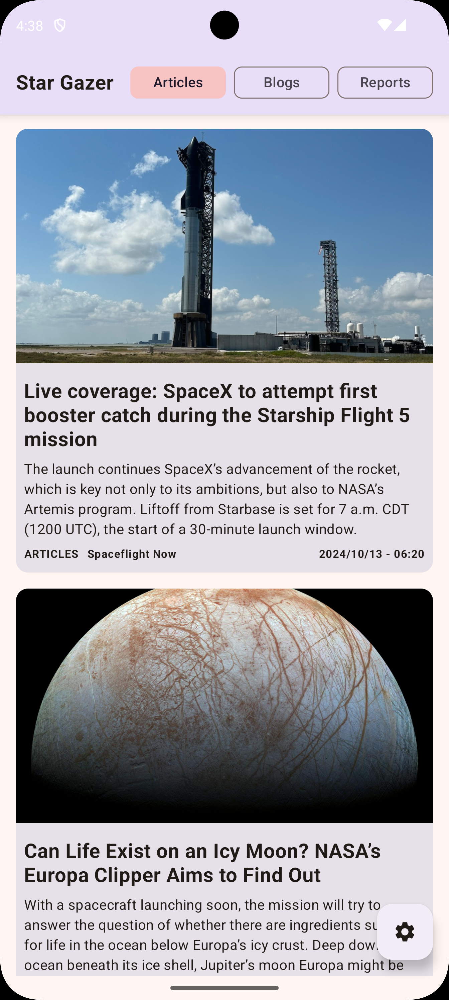

# StarGazer

[English](README.md) | [Español](docs/README.es.md)

StarGazer is a KMM application for Android and iOS built using Kotlin Multiplatform. It uses the [spaceflightnewsapi.net](https://www.spaceflightnewsapi.net/) API to display a list of articles, blogs, and reports about spaceflight.

## Features

*   Cross-platform: Available on both Android and iOS.
*   Modern UI: A clean and intuitive user interface with top filters for easy access to different sections.
*   Three sections:
    *   **Articles:** Displays a list of articles related to spaceflight.
    *   **Blogs:** Features a collection of blog posts about space exploration.
    *   **Reports:** Provides access to reports on space missions and discoveries.
*   Detailed views: Tapping any post opens a detailed view with the full content embedded in a web view.
*   Modularized:
    *   **composeApp**: Contains the executable app where in Android it runs a **MainActivity** with the general Composable of the app, and in iOS it loads the **MainViewController** similarly loading the same Composable.
    *   **posts**: Screen showing posts, settings, and the post detail (webview).
    *   **ds**: Contains the app's typography, colors, and theme.
    *   **network**: Provides the client (Ktor) used to make network requests.
    *   **storage**: Uses DataStore for preferences like dark mode, selected post type, and filter by post news website.
    *   **utils**: Provides methods used across different modules, which require distinct implementations for Android and iOS.

## Screenshots

### Android

    

### iOS

    

## Tech Stack

*   Kotlin Multiplatform
*   Jetpack Compose (Android and iOS)
*   Compose Navigation (Type Safe)
*   Ktor (Networking)
*   Koin (Dependency Injection)
*   Coil (Images)
*   DataStore (Preferences)

## API

This app uses the free and open [spaceflightnewsapi.net](https://www.spaceflightnewsapi.net/) API.

## WIP

*   UI/UX improvements.
*   Testing.
*   Minor fixes.
