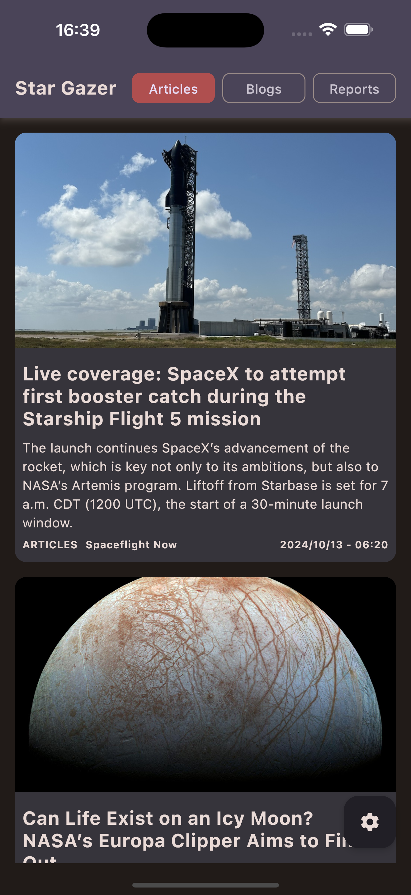

# StarGazer

[English](../README.md) | [Español](README.es.md)

StarGazer es una aplicación KMM para Android e iOS construida utilizando Kotlin Multiplatform. Utiliza la API de [spaceflightnewsapi.net](https://www.spaceflightnewsapi.net/) para mostrar una lista de artículos, blogs y reportes sobre vuelos espaciales.

## Características

*   Multiplataforma: Disponible tanto en Android como en iOS.
*   Interfaz moderna: Una interfaz de usuario limpia e intuitiva con unos filtros superiores para acceder fácilmente a las diferentes secciones.
*   Tres secciones:
    *   **Artículos:** Muestra una lista de artículos relacionados con los vuelos espaciales.
    *   **Blogs:** Presenta una colección de publicaciones de blogs sobre la exploración espacial.
    *   **Reportes:** Proporciona acceso a informes sobre misiones y descubrimientos espaciales.
*   Vistas detalladas: Al tocar cualquier publicación, se abre una vista detallada con el contenido completo en una web embedida.
*   Modularizado:
    *   **composeApp**: Contiene la aplicación ejecutable donde en Android se ejecuta una **MainActivity** con el Composable general de la app y en iOS se carga el **MainViewController** cargando igualmente el mismo Composable.
    *   **posts**: Pantalla donde se muestran los post, settings y el detalle del post en un webview.
    *   **ds**: Contiene la tipografía, colores y Theme de la aplicación.
    *   **network**: Proporciona el cliente (Ktor), que servirá para para realizar las peticiones.
    *   **storage**: Uso de DataStore para las preferencias como el modo oscuro, tipo de post seleccionado y filtro por web de la noticia del post.
    *   **utils**: proporciona métodos que pueden ser usados en varios módulos y cuya característica es que necesitan implementaciones distintas para Android e iOS.

## Capturas de pantalla

### Android

<div style="display: flex; justify-content: space-between;">
    


</div>

### iOS

<div style="display: flex; justify-content: space-between;">
    



</div>

## Tecnologías

*   Kotlin Multiplatform
*   Jetpack Compose (Android e iOS)
*   Compose Navigation (Tipado Seguro)
*   Ktor (Redes)
*   Koin (Inyección de Dependencias)
*   Coil (Imágenes)
*   DataStore (Preferencias)
*   Mokkery (Testing Mocks)

## Testing

La idea de los cambios aplicados para los test, es que estos puedan ser 100% Multiplatform.

Para el mock de los datos, se descartó el uso de **MockK** debido a que la única parte compatible con Multiplatform es **mockk-common** y lleva sin mantenerse desde 2022, a parte de los múltiples errores que da sin dejar muy clara la solución.

Como alternativa actualizada y con un uso similar, decidí usar **[mokkery](https://mokkery.dev/)**, disponiendo de los mismos métodos y capacidad.

En el módulo **composeApp** se han añadido test de compose para validar los distintos estados de la **TopBar**, validando tanto sus estados iniciales como su actualización cuando los datos en **DataStore** se modifican.

En el módulo **posts**, se han añadido test para validar los servicios de **info** y de **posts**. Se validan tanto un resultado positivo como que los resultados del mapper sean correctos y coincidan con los datos fake. A parte, se añaden test de compose para validar el **switch** que cambia del modo claro al modo oscuro.

En cuanto a los test de compose, en ambos composables se le inyecta por **koin** las preferencias, por lo que en las primeras ejecuciones fallaba. Para solucionarlo, creé un composable para crear un contexto donde se dispongan de las instancias necesarias:

```kotlin
import androidx.compose.runtime.Composable
import com.rcudev.posts.di.getDiModules
import org.koin.compose.KoinApplication

@Composable
internal fun KoinTestFrame(
    content: @Composable () -> Unit
) {
    val diModules = getDiModules()

    KoinApplication(application = {
        modules(diModules)
    }) {
        content()
    }
}
```

## API

Esta aplicación utiliza la API gratuita y abierta [spaceflightnewsapi.net](https://www.spaceflightnewsapi.net/).

## WIP

*   Mejoras en la UI/UX.
*   Añadir mas test.
*   Pequeños fix.
