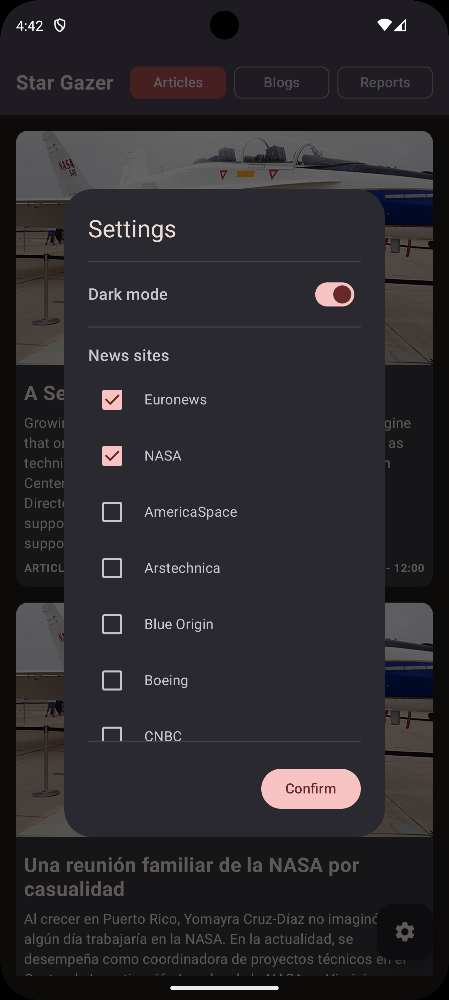
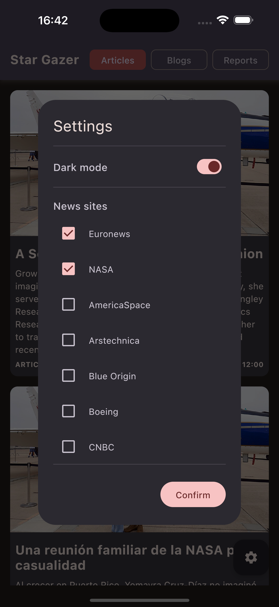

# StarGazer

[English](../README.md) | [Español](README.es.md)

**StarGazer** es una aplicación moderna de Kotlin Multiplatform (KMM) para Android e iOS que muestra contenido relacionado con el espacio utilizando la API de [spaceflightnewsapi.net](https://www.spaceflightnewsapi.net/). Construida con tecnologías de vanguardia y un patrón de arquitectura limpia, demuestra las mejores prácticas para el desarrollo móvil multiplataforma.

## ✨ Características

*   **🌍 Multiplataforma**: Experiencia nativa en Android e iOS desde un único código base
*   **🎨 Interfaz Moderna**: Interfaz limpia e intuitiva construida completamente con Jetpack Compose Multiplatform
*   **📰 Tres Secciones de Contenido**:
    *   **Artículos**: Lista curada de artículos relacionados con el espacio
    *   **Blogs**: Publicaciones de blogs sobre exploración espacial
    *   **Reportes**: Informes detallados sobre misiones y descubrimientos espaciales
*   **🔍 Filtrado Avanzado**: Filtra contenido por fuente de noticias y tipo de contenido
*   **📱 Vistas Detalladas**: WebView integrado para contenido completo del artículo
*   **🌓 Modo Oscuro**: Tema consciente del sistema con alternancia manual
*   **⚡ Arquitectura Reactiva**: Flujo de Datos Unidireccional (UDF) con Molecule
*   **🧪 Testing Completo**: Tests unitarios y de UI con Turbine y Mokkery

## 🏗️ Arquitectura

StarGazer implementa una arquitectura híbrida **ViewModel + Presenter + Molecule** que combina lo mejor de ambos mundos:

```
┌─────────────────────────────────────────┐
│      Capa UI (Compose)                  │
│  • Solo renderiza estado                │
│  • Emite eventos                        │
│  • Observa StateFlow<State>             │
│  • Observa Flow<Effect> para navegación │
└──────────────┬──────────▲───────────────┘
               │ Eventos  │ Estado/Efectos
┌──────────────▼──────────┴───────────────┐
│           ViewModel                      │
│  • Gestiona ciclo de vida (viewModelScope) │
│  • Canaliza eventos desde la UI         │
│  • Expone StateFlow vía launchMolecule  │
│  • Procesa efectos del Presenter        │
└──────────────┬──────────▲───────────────┘
               │ Eventos  │ Estado/Efectos
┌──────────────▼──────────┴───────────────┐
│       Presenter (@Composable)            │
│  • Lógica de negocio con Molecule       │
│  • Recibe Flow<Event>                    │
│  • Retorna Pair<State, Flow<Effect>>    │
│  • Lógica reactiva pura (testeable)     │
└──────────────┬──────────▲───────────────┘
               │ Llamadas │ Resultados
┌──────────────▼──────────┴───────────────┐
│        Capa Dominio/Datos                │
│  • Servicios, Repositorios, DataStore   │
└─────────────────────────────────────────┘
```

### ¿Por Qué Esta Arquitectura?

1. **ViewModel** proporciona `viewModelScope` para gestión automática del ciclo de vida
2. **Presenter** contiene lógica reactiva pura con Molecule (testeable sin UI)
3. **Enfoque híbrido** aprovecha las fortalezas de ambos sin duplicar responsabilidades
4. **Escalable** y permite crear Presenters complejos reutilizables

## 📦 Estructura de Módulos

```
StarGazer/
├── composeApp/          # Aplicación principal (Android/iOS)
│   ├── App.kt           # Punto de entrada con configuración Koin
│   ├── navigation/      # Grafo de navegación Type-Safe
│   └── ui/components/   # Componentes compartidos (TopBar con Presenter)
│
├── posts/               # Módulo de característica: Posts
│   ├── data/            # Implementaciones de servicios
│   ├── domain/          # Interfaces y modelos
│   ├── ui/
│   │   ├── posts/       # Pantalla de posts (Presenter + ViewModel)
│   │   ├── settings/    # Dropdown de ajustes (Presenter + ViewModel)
│   │   └── webview/     # WebView para detalles del artículo
│   └── di/              # Inyección de dependencias Koin
│
├── ds/                  # Sistema de Diseño (colores, tipografía, tema)
├── network/             # Configuración del cliente HTTP Ktor
├── storage/             # DataStore para preferencias
└── utils/               # Utilidades multiplataforma
```

## Capturas de pantalla

### Android

<div style="display: flex; justify-content: space-between;">
    



</div>

### iOS

<div style="display: flex; justify-content: space-between;">
    



</div>

## Tecnologías

### Tecnologías Core
*   **Kotlin 2.2.21** - Lenguaje moderno, conciso y seguro
*   **Kotlin Multiplatform** - Comparte código entre Android e iOS
*   **Jetpack Compose Multiplatform 1.9.2** - Framework de UI declarativa

### Arquitectura y Gestión de Estado
*   **Molecule 2.2.0** - Construye un stream StateFlow usando Jetpack Compose
*   **Compose Navigation** - Navegación type-safe entre pantallas
*   **Flujo de Datos Unidireccional (UDF)** - Gestión de estado predecible

### Networking y Datos
*   **Ktor 3.3.1** - Cliente HTTP multiplataforma
*   **Kotlinx Serialization** - Parsing de JSON
*   **DataStore 1.1.7** - Persistencia de preferencias y ajustes

### Inyección de Dependencias
*   **Koin 4.1.1** - Framework DI ligero con soporte KMM

### UI y Recursos
*   **Coil 3.x** - Carga de imágenes con caché
*   **Material3** - Componentes modernos de Material Design

### Testing
*   **Kotlin Test** - Framework de testing multiplataforma
*   **Turbine 1.2.1** - Librería de testing para Kotlin Flows
*   **Mokkery 2.10.2** - Librería moderna de mocking (reemplaza a MockK sin mantenimiento)
*   **Compose UI Test** - Testing de UI para Compose

## Estrategia de Testing

StarGazer implementa un enfoque completo de testing que cubre todas las capas de la arquitectura:

### 🎯 Tests de Presenter (con Turbine)
Tests para lógica de negocio usando Molecule y Turbine para validar emisiones de estado y efectos:

```kotlin
@Test
fun emitsLoadingStateInitiallyAndThenContentWithPosts() = runTest {
    // Given - PostService retorna una lista de posts
    val mockResponse = Posts(count = 2, results = mockPosts)
    every { suspend { postService.getArticles(...) } } returns Result.success(mockResponse)
    
    val flow = moleculeFlow(RecompositionMode.Immediate) {
        presenter.present(events)
    }
    
    // When - Recolectando el estado
    flow.test {
        // Then - Primera emisión debe ser Loading
        val loadingState = awaitItem().first
        assertIs<PostState.Loading>(loadingState)
        
        // Then - Segunda emisión debe ser Content con posts
        val contentState = awaitItem().first as PostState.Content
        assertEquals(2, contentState.posts.size)
    }
}
```

**Cobertura de Tests:**
*   [PostPresenterTest](../posts/src/commonTest/kotlin/com/rcudev/posts/ui/posts/PostPresenterTest.kt) - Lógica del presenter de pantalla de posts
*   [SettingsPresenterTest](../posts/src/commonTest/kotlin/com/rcudev/posts/ui/settings/SettingsPresenterTest.kt) - Lógica del presenter de ajustes
*   [TopBarPresenterTest](../composeApp/src/commonTest/kotlin/com/rcudev/stargazer/ui/components/TopBarPresenterTest.kt) - Lógica del presenter de TopBar

### 🌐 Tests de Servicios (con Mokkery)
Tests de integración para servicios API usando Mokkery para mocking:

*   [InfoServiceTest](../posts/src/commonTest/kotlin/com/rcudev/posts/data/remote/InfoServiceTest.kt) - Validación de API Info
*   [PostServiceTest](../posts/src/commonTest/kotlin/com/rcudev/posts/data/remote/PostServiceTest.kt) - Validación de API Posts

### 🎨 Tests de Componentes UI
Tests de UI Compose validando comportamiento de componentes y cambios de estado:

*   [TopBarTest](../composeApp/src/commonTest/kotlin/com/rcudev/stargazer/ui/components/TopBarTest.kt) - Estados e interacciones de TopBar
*   [DarkModeItemTest](../posts/src/commonTest/kotlin/com/rcudev/posts/ui/DarkModeItemTest.kt) - Toggle de modo oscuro

### ¿Por Qué Mokkery?

**MockK** fue descartado porque `mockk-common` (la versión multiplataforma) no ha sido mantenida desde 2022 y causa numerosos problemas de compatibilidad. **Mokkery** es la alternativa moderna y activamente mantenida con API similar y soporte completo para KMM.

## API

Esta aplicación utiliza la API gratuita y abierta [spaceflightnewsapi.net](https://www.spaceflightnewsapi.net/) para obtener contenido relacionado con el espacio.

## 🚀 Comenzar

### Prerequisitos
*   **Android Studio** Hedgehog | 2023.1.1 o más reciente
*   **Xcode** 15+ (para desarrollo iOS)
*   **JDK** 17 o superior
*   **Kotlin** 2.2.21

### Ejecutar el Proyecto

#### Android
1. Abre el proyecto en Android Studio
2. Selecciona la configuración `composeApp`
3. Ejecuta en un dispositivo o emulador Android

#### iOS
1. Abre el proyecto en Android Studio
2. Selecciona la configuración `iosApp`
3. Ejecuta en un simulador o dispositivo iOS

Alternativamente, abre `iosApp/iosApp.xcodeproj` en Xcode y ejecuta desde ahí.

## 📚 Conceptos Clave

### Patrón Contract
Cada característica define un **Contract** que contiene:
*   `State`: Estado inmutable de UI (sealed interface)
*   `Event`: Interacciones del usuario (sealed interface)
*   `Effect`: Efectos de una sola vez como navegación (sealed interface)

Ejemplo de `PostContract.kt`:
```kotlin
sealed interface PostState {
    data object Loading : PostState
    data object Error : PostState
    data class Content(val posts: List<Post>) : PostState
}

sealed interface PostEvent {
    data class OnPostClick(val url: String) : PostEvent
    data object LoadNextPage : PostEvent
}

sealed interface PostEffect {
    data class NavigateToWebView(val url: String) : PostEffect
}
```

### Presenter con Molecule
Los Presenters son funciones `@Composable` que usan Molecule para crear estado reactivo:

```kotlin
@Composable
fun present(events: Flow<PostEvent>): Pair<PostState, Flow<PostEffect>> {
    var state by remember { mutableStateOf<PostState>(PostState.Loading) }
    val effects = remember { MutableSharedFlow<PostEffect>() }
    
    // Lógica de negocio reactiva aquí
    
    return state to effects
}
```

### ViewModel como Gestor de Ciclo de Vida
Los ViewModels delegan a los Presenters pero gestionan el ciclo de vida de Android:

```kotlin
class PostViewModel(private val presenter: PostPresenter) : ViewModel() {
    private val events = MutableSharedFlow<PostEvent>(
        extraBufferCapacity = 1,
        onBufferOverflow = BufferOverflow.DROP_LATEST
    )
    private val presentationResult = viewModelScope.launchMolecule(
        mode = RecompositionMode.Immediate
    ) {
        presenter.present(events)  // ✅ Solo se llama UNA vez
    }

    val state: StateFlow<PostState> = presentationResult
        .map { it.first }
        .stateIn(
            scope = viewModelScope,
            started = SharingStarted.WhileSubscribed(5_000),
            initialValue = PostState.Loading
        )

    val effects: Flow<PostEffect> = presentationResult
        .flatMapLatest { it.second }
}
```

## 🛠️ Desarrollo

### Estilo de Código
*   Seguir las [Convenciones de Código de Kotlin](https://kotlinlang.org/docs/coding-conventions.html)
*   Usar nombres significativos para variables y funciones
*   Añadir comentarios KDoc para APIs públicas
*   Mantener las funciones pequeñas y enfocadas

### Añadir una Nueva Característica
1. Crear módulo de característica en el paquete apropiado
2. Definir Contract (State, Event, Effect)
3. Implementar Presenter con lógica de negocio
4. Crear ViewModel como puente de ciclo de vida
5. Construir UI Composable
6. Escribir tests (Presenter, Service, UI)
7. Añadir al grafo de navegación

## 📈 Roadmap

- [x] Arquitectura híbrida ViewModel + Presenter
- [x] Navegación type-safe
- [x] Testing completo con Turbine
- [x] Soporte para modo oscuro
- [ ] Caché offline
- [ ] Funcionalidad de búsqueda
- [ ] Favoritos/Marcadores
- [ ] Compartir artículos
- [ ] Notificaciones push

## WIP

*   Mejoras en la UI/UX
*   Optimizaciones de rendimiento
*   Cobertura adicional de tests
*   Pipeline CI/CD

## 📄 Licencia

Este proyecto está disponible bajo la Licencia MIT.

## 🤝 Contribuir

¡Las contribuciones son bienvenidas! Por favor, siéntete libre de enviar un Pull Request.

---

**Construido con ❤️ usando Kotlin Multiplatform**
